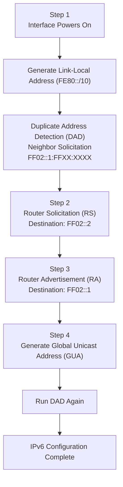
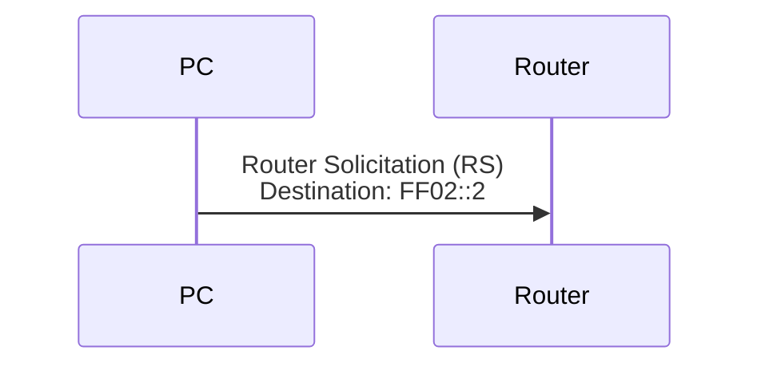
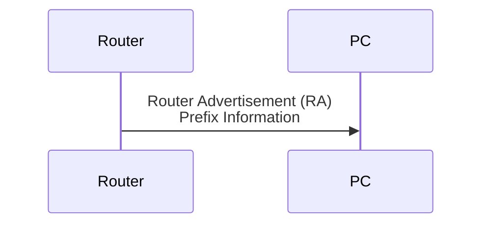

[*← Back to CCNA Index*](../README.MD)

# Stateless Address Autoconfiguration (SLAAC)

**Stateless Address Autoconfiguration (SLAAC)** allows an IPv6 host to automatically configure its own **Global Unicast Address (GUA)** without requiring a DHCPv6 server.

Using **ICMPv6 Neighbor Discovery Protocol (NDP)** messages, a host discovers the local router, learns the network prefix, and generates its own globally unique IPv6 address.

---

# Complete SLAAC Timeline

The following diagram illustrates the entire SLAAC process from the moment a device powers on.



---

# Step 1 — Generate a Link-Local Address

When an IPv6-enabled interface becomes active, the very first action performed is the creation of a **Link-Local Address**.

Every IPv6 interface automatically generates an address from the range:

```
FE80::/10
```

A Link-Local Address allows devices to communicate within the local network before obtaining a globally routable address.

---

## Building the Interface Identifier

The lower 64 bits (Interface ID) can be created in one of two ways.

### Option A — EUI-64

The host derives the Interface ID from its 48-bit MAC address.

Example:

```text
MAC Address

12-34-56-78-9A-BC

↓

Split the MAC Address

12-34-56 | 78-9A-BC

↓

Insert FFFE

12-34-56-FF-FE-78-9A-BC

↓

Invert the Universal/Local (U/L) Bit

↓

Final Interface Identifier
```

---

### Option B — Random Interface Identifier

Modern operating systems (such as Windows 10/11, Linux, and macOS) typically generate a **random Interface ID** for improved privacy instead of exposing the physical MAC address.

---

## Duplicate Address Detection (DAD)

Before using its newly created Link-Local Address, the host verifies that no other device on the network is already using the same address.

This process is known as **Duplicate Address Detection (DAD)**.

The host sends a:

| Field | Value |
| :--- | :--- |
| **Message** | Neighbor Solicitation (NS) |
| **Destination** | Solicited-Node Multicast Address (`FF02::1:FFXX:XXXX`) |

If no device responds, the Link-Local Address is considered unique and becomes active.

> [!NOTE]
> DAD is performed every time a new IPv6 address is created, including Global Unicast Addresses.

---

# Step 2 — Router Solicitation (RS)

Once the host has a valid Link-Local Address, it must discover whether an IPv6 router exists on the local network.

Since it does not yet know the router's address, it sends a **Router Solicitation (RS)** message.



---

## Router Solicitation Details

| Field | Value |
| :--- | :--- |
| **Message Type** | Router Solicitation (RS) |
| **ICMPv6 Type** | 133 |
| **Source Address** | Host Link-Local Address (`FE80::...`) |
| **Destination Address** | `FF02::2` (All-Routers Multicast) |

---

### Why `FF02::2`?

The multicast group:

```
FF02::2
```

represents **All Routers**.

Only IPv6 routers listen to this multicast address.

End hosts such as PCs, printers, and servers ignore these packets completely.

---

# Step 3 — Router Advertisement (RA)

After receiving the Router Solicitation, the router responds with a **Router Advertisement (RA)**.

The RA provides the information needed for the host to configure its IPv6 address.



---

## Router Advertisement Details

| Field | Value |
| :--- | :--- |
| **Message Type** | Router Advertisement (RA) |
| **ICMPv6 Type** | 134 |
| **Source Address** | Router Link-Local Address (`FE80::...`) |
| **Destination Address** | `FF02::1` (All-Nodes Multicast) or directly to the requesting host |

---

## Why `FF02::1`?

Routers periodically advertise themselves even when no host requests information.

Using the multicast address:

```
FF02::1
```

ensures that every IPv6-enabled host on the local network receives updated network configuration information.

---

# Router Advertisement Flags

Inside every Router Advertisement are several important configuration flags.

| Flag | Meaning |
| :--- | :--- |
| **A (Autonomous)** | Use SLAAC to automatically generate the IPv6 address. |
| **M (Managed)** | Obtain the IPv6 address from a Stateful DHCPv6 server instead of SLAAC. |
| **O (Other Configuration)** | Use SLAAC for the IPv6 address but obtain additional information (such as DNS servers) from a Stateless DHCPv6 server. |

---

# Step 4 — Generate the Global Unicast Address (GUA)

Using the information contained in the Router Advertisement, the host constructs its Global Unicast Address.

The process is straightforward:

```
Global Prefix

+

Interface Identifier

=

Global Unicast Address
```

---

## Example

Router Advertisement Prefix:

```text
2001:DB8:1:1::/64
```

Generated Interface Identifier:

```text
0212:34FF:FE56:789A
```

Resulting Global Unicast Address:

```text
2001:DB8:1:1:0212:34FF:FE56:789A
```

---

# Final Duplicate Address Detection (DAD)

Before the newly generated Global Unicast Address becomes operational, the host performs **Duplicate Address Detection** one final time.

Again, it sends:

| Field | Value |
| :--- | :--- |
| **Message** | Neighbor Solicitation (NS) |
| **Destination** | Solicited-Node Multicast Address (`FF02::1:FFXX:XXXX`) |

If no response is received, the address is considered unique and is assigned to the interface.

The host is now fully configured for IPv6 communication.

---

# SLAAC Summary

| Step | Action | Multicast Address Used |
| :--- | :--- | :--- |
| **1** | Generate Link-Local Address | None |
| **2** | Duplicate Address Detection (DAD) | `FF02::1:FFXX:XXXX` |
| **3** | Router Solicitation (RS) | `FF02::2` (All-Routers) |
| **4** | Router Advertisement (RA) | `FF02::1` (All-Nodes) or Unicast |
| **5** | Generate Global Unicast Address | None |
| **6** | Duplicate Address Detection (DAD) | `FF02::1:FFXX:XXXX` |

---

# Key IPv6 Multicast Addresses Used by SLAAC

| Multicast Address | Purpose |
| :--- | :--- |
| `FF02::1` | All Nodes |
| `FF02::2` | All Routers |
| `FF02::1:FFXX:XXXX` | Solicited-Node Multicast (Used by Neighbor Discovery and DAD) |

---

## References

| Resource / Document Title | Link |
| :--- | :--- |
| RFC 4861 — Neighbor Discovery for IPv6 | https://www.rfc-editor.org/rfc/rfc4861 |
| RFC 4862 — IPv6 Stateless Address Autoconfiguration | https://www.rfc-editor.org/rfc/rfc4862 |
| RFC 4291 — IPv6 Addressing Architecture | https://www.rfc-editor.org/rfc/rfc4291 |
| Cisco IPv6 Configuration Guide | https://www.cisco.com/c/en/us/support/ios-nx-os-software/ipv6/products-installation-and-configuration-guides-list.html |
| Wikipedia — Stateless Address Autoconfiguration | https://en.wikipedia.org/wiki/IPv6_address#Stateless_address_autoconfiguration |
