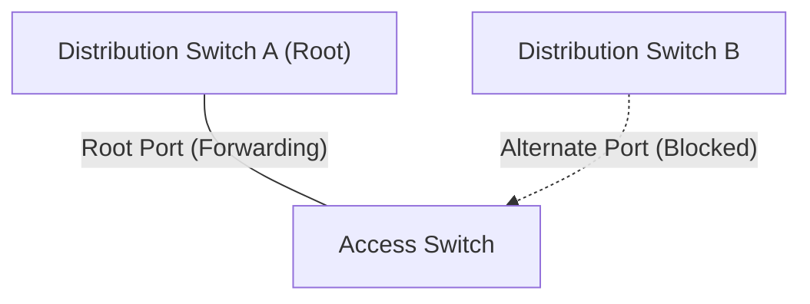
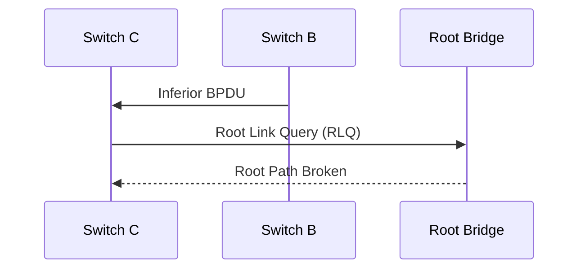

[*← Back to CCNA Index*](../README.MD)

# UplinkFast & BackboneFast

**UplinkFast** and **BackboneFast** were enhancements introduced to **Classic Spanning Tree Protocol (IEEE 802.1D)** to reduce convergence time after network failures. Understanding why these features were needed makes it much easier to appreciate how modern protocols like **Rapid Spanning Tree Protocol (RSTP)** solve these problems by default.

---

## Why Were They Needed?

Classic STP was intentionally conservative. Before a blocked port could begin forwarding traffic, it had to pass through the following states:

```
Blocking
   │
   ▼
Listening (15 seconds)
   │
   ▼
Learning (15 seconds)
   │
   ▼
Forwarding
```

This meant that even when a perfectly good backup path already existed, traffic could be interrupted for **30–50 seconds** while STP converged.

---

# UplinkFast (Direct Link Failures)

UplinkFast is best thought of as a **pre-planned backup mechanism** for **access switches**.

---

## The Problem in Classic STP

Consider an access switch connected to two upstream distribution switches.



One link is actively forwarding traffic (**Root Port**), while the other remains blocked as a backup.

If the primary uplink cable is unplugged or cut:

- The switch immediately detects the physical link failure.
- However, Classic STP still requires the backup port to transition through:
  - **Listening (15 seconds)**
  - **Learning (15 seconds)**
- Total downtime is approximately **30 seconds**, even though the backup link was already available.

---

## How UplinkFast Solves It

UplinkFast tells the access switch:

> *"If your active upstream link physically fails, immediately transition the backup blocked port into the Forwarding state."*

Instead of waiting for the normal STP timers, the backup path becomes active almost instantly.

| Classic STP | With UplinkFast |
| :--- | :--- |
| ~30 seconds | Approximately **1–3 seconds** |

---

## MAC Address Table Update

Immediately after activating the backup link, the switch transmits **dummy multicast frames** using its own local MAC addresses.

These frames force upstream switches to refresh their MAC address tables so traffic is immediately redirected along the new path rather than waiting for old MAC entries to age out.

> [!NOTE]
> UplinkFast improves **direct physical uplink failures** where the access switch itself loses connectivity on its active uplink.

---

# BackboneFast (Indirect Link Failures)

BackboneFast addresses a completely different problem.

Rather than solving **direct link failures**, it accelerates recovery from **indirect failures occurring elsewhere in the network**.

---

## The Problem in Classic STP

Consider the following topology.


Suppose the link between **Switch A** and **Switch B** suddenly fails.

Notice that **Switch C never loses physical connectivity on any of its own ports**.

Instead:

1. Switch B stops receiving BPDUs from the Root Bridge.
2. Switch B incorrectly assumes it has become closer to the root.
3. Switch B begins sending **Inferior BPDUs** toward Switch C.

---

## Classic STP Response

When Switch C receives these inferior BPDUs, it already has a better BPDU saved from the real Root Bridge.

Its response is essentially:

> *"I already know of a better Root Bridge than the one you're advertising."*

Unfortunately, Classic STP still forces Switch C to wait for the **Max Age timer (20 seconds)** before discarding the old information.

After that delay, it must still perform the normal STP transition:

- Listening (15 seconds)
- Learning (15 seconds)

| Waiting Period | Time |
| :--- | :---: |
| Max Age Timer | 20 seconds |
| Listening | 15 seconds |
| Learning | 15 seconds |
| **Total** | **50 seconds** |

---

## How BackboneFast Solves It

When Switch C receives an **Inferior BPDU**, BackboneFast immediately begins verifying whether the Root Bridge is still reachable.

It does this using a special message called a **Root Link Query (RLQ)**.



If the Root Bridge confirms that the path has indeed failed, Switch C immediately expires its **20-second Max Age timer** instead of waiting for it to naturally time out.

---

## Result

BackboneFast removes the **20-second Max Age delay**, leaving only the normal Listening and Learning phases.

| Classic STP | With BackboneFast |
| :--- | :--- |
| 50 seconds | 30 seconds |

---

# Summary Cheat Sheet

| Feature | Purpose | Improvement |
| :--- | :--- | :--- |
| **PortFast** | Used on end-user ports (PCs, printers). Skips Listening and Learning entirely. | Immediate transition to **Forwarding** |
| **UplinkFast** | Handles **direct uplink failures** on access switches. Immediately activates the backup uplink. | **30 seconds → ~1–3 seconds** |
| **BackboneFast** | Handles **indirect failures** elsewhere in the STP topology using **Root Link Queries (RLQs)**. | **50 seconds → 30 seconds** |

---

## References

| Resource / Document Title | Link |
| :--- | :--- |
| IEEE 802.1D Spanning Tree Protocol | https://standards.ieee.org/standard/802_1D-2004.html |
| Cisco STP Enhancements (PortFast, UplinkFast & BackboneFast) | https://www.cisco.com/c/en/us/support/docs/lan-switching/spanning-tree-protocol/10588-3.html |
| Cisco Campus Network STP Design Guide | https://www.cisco.com/c/en/us/support/docs/lan-switching/spanning-tree-protocol/5234-5.html |
| Wikipedia — Spanning Tree Protocol | https://en.wikipedia.org/wiki/Spanning_Tree_Protocol |
| RFC Archive (IEEE STP references) | https://www.rfc-editor.org/ |
