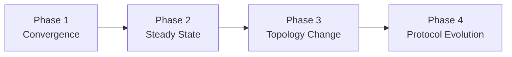
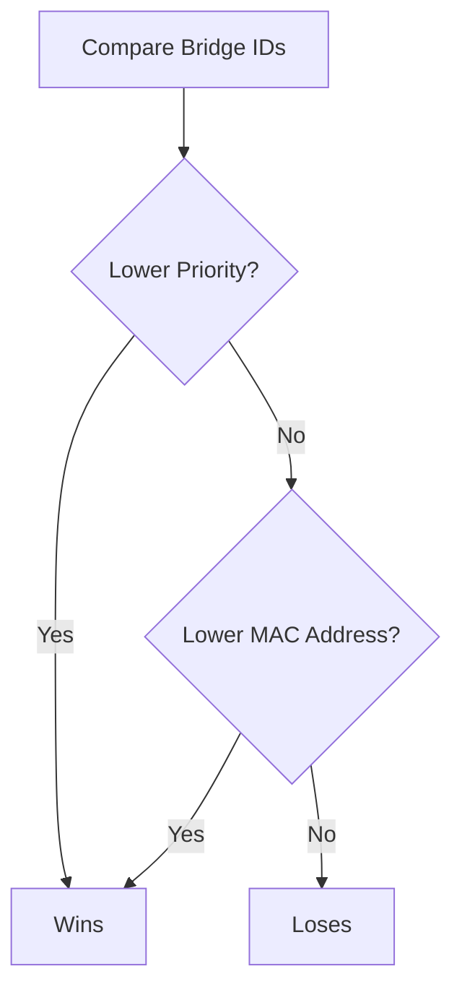
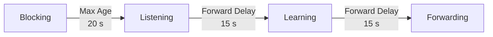
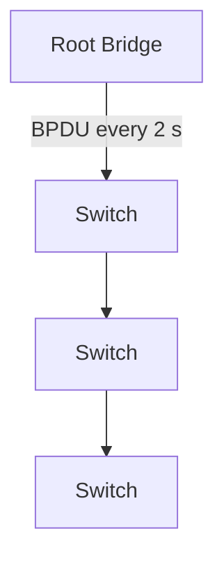
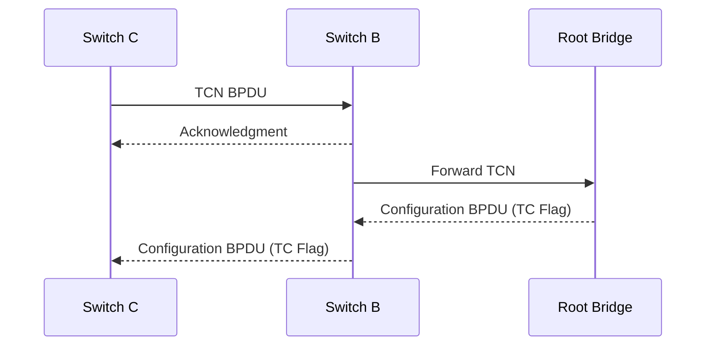
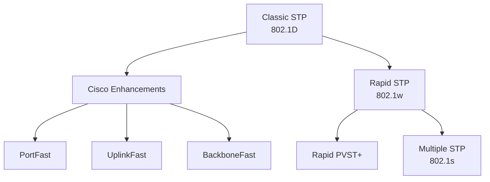

[*← Back to CCNA Index*](../README.MD)

# Spanning Tree Protocol (STP) — Complete Operation (IEEE 802.1D)

**Spanning Tree Protocol (STP)** is a Layer 2 loop prevention protocol standardized as **IEEE 802.1D**. Its purpose is to create a loop-free topology by logically blocking redundant paths while still keeping them available as backups.

The easiest way to understand STP is to view it as one continuous process from the moment switches power on, through normal operation, to recovering from topology changes.

---

# STP Lifecycle Overview



---

# Phase 1 — Convergence

During convergence, switches discover each other, elect a Root Bridge, assign port roles, and transition ports into their operational states.

---

## Switch Bootup

When a switch powers on, it has no knowledge of the network topology.

Initially:

- Every switch assumes it is the **Root Bridge**.
- Every switch begins transmitting **Configuration BPDUs**.
- User traffic is temporarily blocked while the topology is calculated.

---

## Configuration BPDU

Configuration BPDUs contain the information required to elect the Root Bridge.

Most importantly, they carry the switch's **Bridge ID (BID)**.

The Bridge ID consists of:

$$
\text{Bridge ID} = \text{Priority} + \text{System ID Extension (VLAN)} + \text{MAC Address}
$$

Example:

| Field | Default Value |
| :--- | :--- |
| Bridge Priority | 32768 |
| System ID Extension | VLAN ID |
| MAC Address | Switch MAC Address |

---

## Initial Port State

At startup:

- Ports begin in the **Blocking** state (or quickly transition into Listening depending on implementation).
- Only BPDUs are exchanged.
- User traffic is not forwarded.

---

# Root Bridge Election

As switches receive Configuration BPDUs from neighboring switches, they compare Bridge IDs.

The switch advertising the **lowest Bridge ID** becomes the Root Bridge.

---

## Root Bridge Election Rules



---

### Tie-Breakers

| Priority | Decision |
| :--- | :--- |
| 1 | Lowest Bridge Priority |
| 2 | Lowest MAC Address |

Whenever a switch receives a **superior BPDU**, it immediately stops claiming to be the Root Bridge and begins forwarding the superior BPDU instead.

---

# Port Role Selection

Once the Root Bridge has been elected, every switch determines the role of each interface.

---

## Root Port (RP)

Every **non-root switch** selects **one Root Port**.

A Root Port is the interface providing the **lowest total path cost** back to the Root Bridge.

### Root Port Selection Order

| Tie-Breaker | Selection Criteria |
| :--- | :--- |
| 1 | Lowest Cumulative Path Cost |
| 2 | Lowest Neighbor Bridge ID |
| 3 | Lowest Neighbor Port ID |

Typical STP Costs:

| Speed | Cost |
| :--- | ---: |
| 10 Gbps | 2 |
| 1 Gbps | 4 |
| 100 Mbps | 19 |

---

## Designated Port (DP)

Every network segment requires exactly **one Designated Port**.

The switch with the lowest path cost toward the Root Bridge becomes the Designated Bridge for that segment.

> [!IMPORTANT]
> Every port on the Root Bridge is automatically a **Designated Port**.

---

## Alternate (Blocked) Port

Any remaining port that is neither:

- Root Port
- Designated Port

becomes an **Alternate (Blocked) Port**.

This is the mechanism that removes Layer 2 loops while preserving redundant links for future failures.

---

# Port State Transitions

Ports do not immediately begin forwarding traffic.

Instead, STP forces every forwarding port through several transitional states.



---

## Port States

### Blocking

- Receives Configuration BPDUs
- Does **not** forward user traffic
- Does **not** learn MAC addresses

---

### Listening (15 Seconds)

Purpose:

- Process BPDUs
- Elect Root and Designated Ports

Characteristics:

- No user traffic
- No MAC learning

---

### Learning (15 Seconds)

Purpose:

Prepare the switch for forwarding.

Characteristics:

- Learns MAC addresses
- Builds MAC Address Table
- Still does not forward user traffic

---

### Forwarding

Normal operation.

The interface:

- Learns MAC addresses
- Sends user traffic
- Receives user traffic
- Continues processing BPDUs

---

## Initial Convergence Time

| Timer | Value |
| :--- | ---: |
| Max Age | 20 s |
| Listening | 15 s |
| Learning | 15 s |
| **Maximum Total** | **50 Seconds** |

---

# Phase 2 — Steady State

Once convergence is complete, the topology remains stable.

Only the Root Bridge generates original Configuration BPDUs.

These BPDUs are forwarded downstream through the spanning tree.



---

## STP Timers

| Timer | Default | Purpose |
| :--- | ---: | :--- |
| Hello Time | 2 seconds | Root Bridge sends Configuration BPDUs |
| Max Age | 20 seconds | Time a switch retains BPDU information before considering it invalid |
| Forward Delay | 15 seconds | Time spent in Listening and Learning |

---

# Phase 3 — Topology Changes

Suppose a cable is unplugged.

The network must notify every switch that the topology has changed.

---

## Topology Change Process



---

## Complete Process

1. A link fails.
2. The affected switch generates a **Topology Change Notification (TCN) BPDU**.
3. Intermediate switches acknowledge the TCN and forward it toward the Root Bridge.
4. The Root Bridge receives the notification.
5. The Root sets the **Topology Change (TC) Flag** inside future Configuration BPDUs.
6. Every switch receives the TC Flag.

---

## MAC Address Table Aging

Normally:

```
MAC Address Aging Timer

↓

300 Seconds
```

During a topology change:

```
MAC Address Aging Timer

↓

15 Seconds
```

This allows switches to quickly forget outdated forwarding information and rapidly learn the new forwarding paths.

> [!NOTE]
> Without reducing the aging timer, switches might continue forwarding traffic toward interfaces that no longer lead to the correct destination.

---

# Phase 4 — Evolution of STP

Over time, STP evolved to reduce convergence times while preserving the same core concepts.



---

## Classic STP (IEEE 802.1D)

- One STP instance for the entire switch
- Convergence time of **30–50 seconds**

---

## Cisco Enhancements

| Feature | Purpose |
| :--- | :--- |
| PortFast | Immediately transitions edge ports to Forwarding |
| UplinkFast | Instantly activates backup uplinks after direct failures |
| BackboneFast | Removes the 20-second Max Age delay during indirect failures |

---

## Rapid Spanning Tree Protocol (RSTP — IEEE 802.1w)

RSTP retains the same Root Bridge election and port role concepts but replaces timer-based convergence with an active **Proposal/Agreement** handshake.

Advantages include:

- Millisecond convergence
- Built-in Edge Ports (PortFast)
- Built-in UplinkFast behavior
- Built-in BackboneFast behavior

---

## PVST+, Rapid PVST+, and MST

| Protocol | Description |
| :--- | :--- |
| **PVST+** | Cisco implementation of one STP instance per VLAN using IEEE 802.1Q trunks. |
| **Rapid PVST+** | Runs one Rapid STP (RSTP) instance per VLAN. |
| **MST (IEEE 802.1s)** | Maps multiple VLANs into a single spanning tree instance, reducing CPU and memory usage in large networks. |

---

# STP Summary

| Phase | Purpose |
| :--- | :--- |
| **1** | Elect the Root Bridge and determine port roles |
| **2** | Maintain a stable loop-free topology using Configuration BPDUs |
| **3** | Detect topology changes, propagate TCNs, and refresh MAC tables |
| **4** | Improve convergence using Cisco enhancements, RSTP, PVST+, RPVST+, and MST |

---

## References

| Resource / Document Title | Link |
| :--- | :--- |
| IEEE 802.1D — Media Access Control (MAC) Bridges | https://standards.ieee.org/standard/802_1D-2004.html |
| IEEE 802.1w — Rapid Reconfiguration of Spanning Tree | https://standards.ieee.org/ |
| IEEE 802.1s — Multiple Spanning Tree Protocol | https://standards.ieee.org/ |
| Cisco STP Design Guide | https://www.cisco.com/c/en/us/support/docs/lan-switching/spanning-tree-protocol/5234-5.html |
| Cisco Understanding STP | https://www.cisco.com/c/en/us/support/docs/lan-switching/spanning-tree-protocol/24062-146.html |
| Wikipedia — Spanning Tree Protocol | https://en.wikipedia.org/wiki/Spanning_Tree_Protocol |
