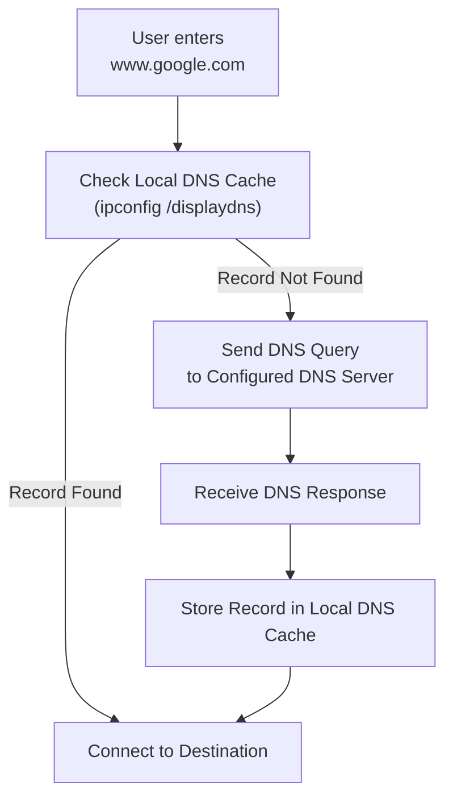
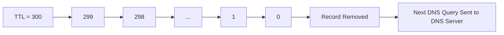

[*← Back to CCNA Index*](../README.MD)

# DNS Caching & Time To Live (TTL)

**Domain Name System (DNS)** caching improves network performance by storing recently resolved domain names locally. Instead of contacting a DNS server every time a website is visited, the operating system first checks its local DNS cache for an existing record.

---

# How DNS Caching Works

When a user enters a domain name, the operating system follows a simple decision process.



---

## What "New Requests" Actually Mean

A common misconception is that once DNS caching is enabled, the computer never contacts the DNS server again.

That is **not** how DNS caching works.

The behavior depends on whether the requested domain already exists in the local cache.

| Cache Status | Action |
| :--- | :--- |
| **Domain Found** | The operating system uses the cached IP address immediately. No DNS query is sent to the DNS server. |
| **Domain Not Found** | The operating system sends a DNS request to the configured DNS server, receives the response, stores it in the local cache, and then connects to the destination. |

> [!IMPORTANT]
> DNS caching **does not eliminate DNS queries completely**. It only prevents **repeated lookups** for domains that have already been resolved and are still stored in the cache.

---

# Time To Live (TTL)

Every DNS record stored in the cache has an associated **Time To Live (TTL)** value.

The TTL is assigned by the authoritative DNS server and determines **how long the operating system is allowed to keep the record before requesting a fresh copy.**

---

## Example:

Running:

```plaintext
ipconfig /displaydns
```

may display something similar to:

```plaintext
Record Name . . . . . : www.cisco.com
Record Type . . . . . : 1
Time To Live  . . . . : 285
Data Length . . . . . : 4
Section . . . . . . . : Answer
A (Host) Record . . . : 104.93.208.77
```

---

## Understanding the TTL Field

The **Time To Live** value represents the remaining lifetime of the cached DNS record.

For example:

```text
Time To Live : 285
```

means the operating system will continue using this cached entry for another **285 seconds**.

Every second:

- The TTL decreases by one.
- The cached record remains valid while the TTL is greater than zero.

When the TTL reaches **0**:

- The cached DNS record is automatically removed.
- The next request for that domain must be sent to the configured DNS server.
- The DNS server returns a fresh record, which is then stored in the cache with a new TTL value.



> [!NOTE]
> TTL ensures that cached DNS records eventually expire, allowing clients to learn updated IP addresses if a website changes servers.

---

# DNS Cache Troubleshooting

The following commands are commonly used when troubleshooting DNS-related issues.

| Command | Purpose |
| :--- | :--- |
| `ipconfig /displaydns` | Displays the contents of the local DNS cache. |
| `ipconfig /flushdns` | Clears the local DNS cache, forcing future DNS lookups to query the configured DNS server again. |

---

## When Should You Flush the DNS Cache?

One common scenario is when a website changes its IP address.

Your computer may still be trying to reach the **old cached IP address**, causing connection problems.

Running:

```plaintext
ipconfig /flushdns
```

removes all cached DNS entries.

The next time you visit the website:

1. The operating system has no cached entry.
2. A new DNS query is sent to the DNS server.
3. The updated IP address is returned.
4. The new record is stored in the local DNS cache.

---

## References

| Resource / Document Title | Link |
| :--- | :--- |
| RFC 1034 — Domain Names: Concepts and Facilities | https://www.rfc-editor.org/rfc/rfc1034 |
| RFC 1035 — Domain Names: Implementation and Specification | https://www.rfc-editor.org/rfc/rfc1035 |
| Microsoft — `ipconfig` Command Reference | https://learn.microsoft.com/windows-server/administration/windows-commands/ipconfig |
| Cloudflare Learning Center — What is DNS Caching? | https://www.cloudflare.com/learning/dns/what-is-dns-cache/ |
| Cisco — DNS Overview | https://www.cisco.com/c/en/us/support/docs/ip/domain-name-system-dns/ |
| Wikipedia — Domain Name System | https://en.wikipedia.org/wiki/Domain_Name_System |
