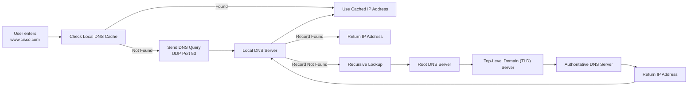

[*← Back to CCNA Index*](../README.MD)

# Domain Name System (DNS)

The **Domain Name System (DNS)** is a distributed, hierarchical naming system that translates **human-readable domain names** (such as `www.cisco.com`) into **IP addresses** that computers use for communication.

Without DNS, users would need to remember numerical IP addresses instead of easy to read domain names.

---

# DNS Query Flow

When a user enters a domain name into a web browser, the operating system follows a series of steps to resolve that name into an IP address.



---

# DNS Resolution Process

The DNS resolution process occurs in the following order:

1. The client checks its **local DNS cache**.
2. If no cached record exists, the client sends a DNS query to its configured DNS server.
3. The DNS server checks its own cache or local zone database.
4. If the record is unavailable, the DNS server performs recursive queries:
   - Root DNS Server
   - Top-Level Domain (TLD) Server
   - Authoritative DNS Server
5. The authoritative server returns the requested record.
6. The DNS server forwards the response to the client.
7. The client stores the result in its local DNS cache according to the record's **Time To Live (TTL)**.

---

# DNS Transport Protocols

DNS primarily uses **Port 53**, but both UDP and TCP are employed depending on the operation.

| Protocol | Port | Purpose |
| :--- | :---: | :--- |
| **UDP** | 53 | Standard DNS queries and responses. Fast and low overhead. |
| **TCP** | 53 | Used when DNS responses exceed **512 bytes** or during DNS Zone Transfers between DNS servers. |

> [!NOTE]
> Most DNS client queries use **UDP** because it is faster and has lower overhead than TCP.

---

# Common DNS Record Types

DNS stores different types of resource records depending on the information being requested.

| Record Type | Name | Purpose | Example |
| :--- | :--- | :--- | :--- |
| **A** | IPv4 Host Record | Maps a hostname to an IPv4 address. | `server1.lab.local → 192.168.1.50` |
| **AAAA** | IPv6 Host Record | Maps a hostname to an IPv6 address. | `server1.lab.local → 2001:db8::50` |
| **CNAME** | Canonical Name | Creates an alias that points to another hostname. | `www.google.com → google.com` |
| **PTR** | Pointer Record | Performs reverse DNS lookups by mapping an IP address to a hostname. | `192.168.1.50 → server1.lab.local` |
| **NS** | Name Server Record | Identifies the authoritative DNS server for a domain. | `ns1.google.com` |

---

# Cisco Router as a DNS Client

A Cisco router can function as a DNS client, allowing it to resolve hostnames by querying external DNS servers.

## Configuration

```cisco
Router(config)# ip domain-lookup

Router(config)# ip name-server 8.8.8.8 8.8.4.4
```

### Commands

| Command | Purpose |
| :--- | :--- |
| `ip domain-lookup` | Enables DNS hostname resolution (enabled by default). |
| `ip name-server` | Specifies one or more upstream DNS servers to query. |

---

# Cisco Router as a DNS Server

Cisco IOS can also provide a simple local DNS service for small networks.

## Enable the DNS Server

```cisco
Router(config)# ip dns server
```

---

## Configure Static Host Records

```cisco
Router(config)# ip host host1.lab.local 192.168.1.50

Router(config)# ip host host2.lab.local 192.168.1.51
```

These entries function as locally configured **A Records**.

---

# Verification Commands

| Command | Purpose |
| :--- | :--- |
| `show hosts` | Displays cached DNS entries and manually configured hostname-to-IP mappings. |
| `nslookup <domain>` | Queries the configured DNS server directly to verify name resolution (Windows/Linux). |

---

# DNS Troubleshooting

Useful client-side commands:

| Command | Purpose |
| :--- | :--- |
| `ipconfig /displaydns` | Displays the local DNS cache. |
| `ipconfig /flushdns` | Clears the DNS cache. |
| `nslookup <hostname>` | Tests DNS name resolution. |

---

# DNS Summary

| Feature | Description |
| :--- | :--- |
| **Protocol** | Domain Name System (DNS) |
| **Primary Purpose** | Resolve hostnames into IP addresses |
| **Default Port** | 53 |
| **UDP** | Standard client queries and responses |
| **TCP** | Large responses and DNS Zone Transfers |
| **A Record** | Hostname → IPv4 Address |
| **AAAA Record** | Hostname → IPv6 Address |
| **CNAME Record** | Alias → Hostname |
| **PTR Record** | IP Address → Hostname (Reverse Lookup) |
| **NS Record** | Authoritative Name Server |

---

# Related CCNA Topics

DNS commonly works together with several other networking services.

| Protocol | Purpose |
| :--- | :--- |
| **DHCP** | Automatically assigns IP addresses and can provide DNS server addresses to clients. |
| **Cisco CLI Pipes** | Use `\| include`, `\| exclude`, and `\| section` to efficiently filter command output. |
| **DNS** | Uses **UDP Port 53** for normal queries and **TCP Port 53** for zone transfers and large responses. |

> [!TIP]
> **CCNA Must Remember this**
>
> - **DHCP** → Automatically provides IP configuration.
> - **DNS** → Resolves names to IP addresses.
> - **UDP 53** → Standard DNS lookups.
> - **TCP 53** → Zone transfers and large DNS responses.
> - **A** = IPv4
> - **AAAA** = IPv6
> - **CNAME** = Alias
> - **PTR** = Reverse Lookup

---

## References

| Resource / Document Title | Link |
| :--- | :--- |
| RFC 1034 — Domain Names: Concepts and Facilities | https://www.rfc-editor.org/rfc/rfc1034 |
| RFC 1035 — Domain Names: Implementation and Specification | https://www.rfc-editor.org/rfc/rfc1035 |
| RFC 3596 — DNS Extensions to Support IPv6 | https://www.rfc-editor.org/rfc/rfc3596 |
| Cisco IOS IP Addressing Services Configuration Guide | https://www.cisco.com/c/en/us/support/ios-nx-os-software/ip-addressing-services/products-installation-and-configuration-guides-list.html |
| Microsoft — `nslookup` Command Reference | https://learn.microsoft.com/windows-server/administration/windows-commands/nslookup |
| Wikipedia — Domain Name System | https://en.wikipedia.org/wiki/Domain_Name_System |
