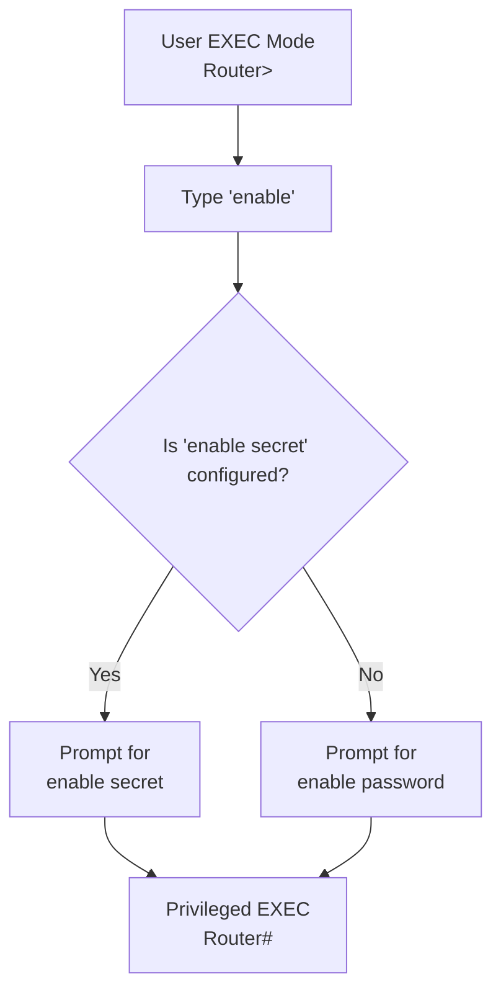

[*← Back to CCNA Index*](../README.MD)

# Cisco Password Security

Cisco IOS provides multiple mechanisms for protecting access to the router. Understanding how **`service password-encryption`**, **`enable password`**, and **`enable secret`** work and how they interact is an important CCNA topic.

---

# `service password-encryption`

The `service password-encryption` command protects plain-text passwords stored in the running configuration by converting them into **Type 7 encrypted strings**.

> [!IMPORTANT]
> This command **does not provide strong security**. Its purpose is simply to prevent someone from reading passwords directly from the configuration file.

---

## How It Works

| Property | Description |
| :--- | :--- |
| **Algorithm** | Cisco Type 7 Encryption (Modified Vigenère Cipher) |
| **Security Level** | Weak |
| **Purpose** | Prevents casual viewing ("Shoulder Surfing") of passwords |
| **Can it be decrypted?** | Yes. Type 7 passwords can be reversed almost instantly using publicly available tools. |

---

## Which Passwords Are Affected?

The command encrypts passwords that would normally appear in plain text inside the configuration.

Examples include:

- `enable password`
- `line console` passwords
- `line vty` passwords
- AUX line passwords

---

## What Happens When You Enable It?

Suppose the running configuration currently contains plain-text passwords.

```plaintext
enable password cisco

line console 0
 password class

line vty 0 4
 password telnet
```

After enabling the command:

```plaintext
Router(config)# service password-encryption
```

Cisco immediately converts every existing plain-text password into **Type 7** encrypted strings.

---

## What Happens If You Remove It?

```plaintext
Router(config)# no service password-encryption
```

This behavior is commonly misunderstood.

> [!IMPORTANT]
> Removing the command **does NOT decrypt existing passwords**.

The behavior is:

| Existing Type 7 Passwords | New Passwords Entered Afterwards |
| :--- | :--- |
| **Remain encrypted** | Saved in **plain text** |

Cisco never converts encrypted passwords back into readable text.

---

# `enable password` vs `enable secret`

Both commands are used to access **Privileged EXEC Mode (`Router#`)**, but they differ significantly in security.

---

## Privilege Escalation Process



---

## Key Behavior

Both commands protect access to **Privileged EXEC Mode**.

However:

> [!IMPORTANT]
> If **both** `enable password` **and** `enable secret` are configured, **Cisco completely ignores the `enable password`.**

Only the **enable secret** will be accepted.

---

## What `enable secret` Does NOT Override

A common misconception is that `enable secret` replaces every password on the router.

It does **not**.

It only replaces **`enable password`**.

The following passwords continue to work independently:

- Console Password (`line console 0`)
- VTY Passwords (`line vty 0 4`)
- AUX Passwords

These authenticate users entering **User EXEC Mode (`Router>`)**, whereas **enable secret** is only used to move from:

```text
Router>

↓

Router#
```

---

# Password Comparison

| Command | Encryption Type | Security Level | Purpose |
| :--- | :--- | :--- | :--- |
| `enable password <password>` | Type 0 (Plain Text)<br>Type 7 when `service password-encryption` is enabled | Weak | Legacy method for accessing Privileged EXEC Mode (`Router#`). Ignored when `enable secret` exists. |
| `enable secret <password>` | Type 5 (MD5)<br>Type 8 / Type 9 on newer Cisco IOS versions | Strong | Recommended method for protecting Privileged EXEC Mode (`Router#`). Overrides `enable password`. |
| `service password-encryption` | Type 7 | Weak | Encrypts plain-text passwords stored in the configuration file. |

---

# Example Configuration

```plaintext
Router(config)# service password-encryption

Router(config)# enable password cisco

Router(config)# enable secret chennai

Router(config)# line console 0
Router(config-line)# password consolepass
Router(config-line)# login

Router(config)# line vty 0 4
Router(config-line)# password telnetpass
Router(config-line)# login
```

---

# Quick Check

> [!TIP]
> **Question**
>
> If you configure:
>
> ```plaintext
> line console 0
> password cisco
>
> enable secret chennai
> ```
>
> Which password do you enter **immediately after connecting your console cable to the router?**

**Answer:**

When you first connect through the console, you authenticate using the **Console Password (`cisco`)**.

After reaching:

```text
Router>
```

typing:

```plaintext
enable
```

will then prompt for the **enable secret (`chennai`)** to enter:

```text
Router#
```

---

## References

| Resource / Document Title | Link |
| :--- | :--- |
| Cisco IOS Security Configuration Guide | https://www.cisco.com/c/en/us/support/security/ios-network-security/products-installation-and-configuration-guides-list.html |
| Cisco Password Encryption Documentation | https://www.cisco.com/c/en/us/support/docs/security-vpn/terminal-access-controller-access-control-system-tacacs-/15166-passwd-encryp.html |
| Cisco IOS Command Reference | https://www.cisco.com/c/en/us/support/ios-nx-os-software/ios-software/products-command-reference-list.html |
| Wikipedia — Cisco Password Types | https://en.wikipedia.org/wiki/Cisco_IOS |
| RFC 1321 — MD5 Message-Digest Algorithm | https://www.rfc-editor.org/rfc/rfc1321 |
